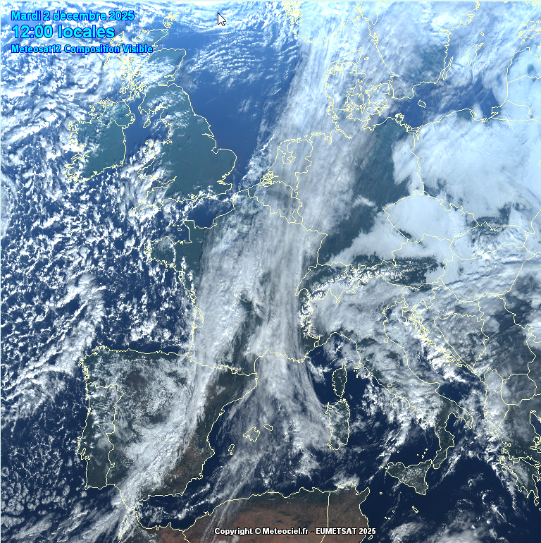

# Étude de cas météo – Nîmes/Courbessac (2 décembre 2025)

> **Relier “le temps qu’il fait” à la structure verticale de l’atmosphère, avec l’appui d’une IA.**  
> Émagramme (Skew-T) + satellite Meteosat + champs de pression + interprétation physique.

Ce dépôt présente une étude de cas centrée sur la station de radiosondage **Nîmes/Courbessac** le **2 décembre 2025 à 12h locales**.  
L’objectif principal est **pédagogique** :

- apprendre à lire un **émagramme** de façon rigoureuse,  
- recouper ces informations avec les images satellites et les cartes de pression,  
- utiliser un **LLM (GPT / Mistral)** pour structurer, commenter et approfondir l’analyse,  
- montrer comment une collaboration **Humain + IA** peut accélérer l’apprentissage en météorologie.

---

## 1. Arborescence du dépôt

```text
.
├── README.md              # Version anglaise (résumé)
├── README_fr.md           # Version française détaillée
└── graphe_images_resume/
    ├── analyse_emagramme.pdf
    ├── composition_IR_visible.png
    ├── Nimes_radiosondage.png
    ├── pressions.png
    ├── nebulosite_octas.png
    └── Visible.png
```

---

## 2. Contexte météorologique

- **Station** : Nîmes/Courbessac (~60 m).  
- **Date / heure** : mardi 2 décembre 2025, 12h locales.  
- **Situation synoptique** :
  - dépression modérée sur le nord de la France (1000–1004 hPa),  
  - **marais barométrique** sur la moitié sud (1012–1014 hPa),  
  - large bande nuageuse **étirée nord–sud** sur le pays,  
  - pas de convection profonde (CAPE quasi nulle).

Cette configuration est typique d’un temps **stratiforme**, avec Sc/As, éclaircies locales et pluies faibles ou absentes.

---

## 3. Résultats principaux de l’analyse de l’émagramme

### 3.1 Surface 1000 hPa

- Altitude de la surface **1000 hPa** : ~122 m (≈ 62 m au-dessus de la station).  
- À ce niveau :
  - **T ≈ 9 °C**, **Tw ≈ 8 °C**, **RH ≈ 83 %**.

### 3.2 Couche de stratocumulus (≈ 1,6–2,4 km)

- Entre **1585 m et 2397 m** :
  - T et Td pratiquement confondus → **saturation (RH ≈ 100 %)**,  
  - T décroît de +1,5 °C à −4,5 °C,  
  - interprétation : **couche de stratocumulus** bien définie.

### 3.3 Couche sèche et inversion (≈ 2,4–2,6 km)

- Entre **2397 m et 2617 m** :
  - inversion de +1,5 °C sur ~220 m,  
  - Td chute de −5 °C à −20 °C,  
  - Tw passe de −5 °C à −8,5 °C,  
  - RH ≈ 37 %.  

➡️ Interprétation : **subsidence locale** ou **advection d’air sec** en altitude.

### 3.4 Couche de transition avec gradient proche du standard (~2,6–4,0 km)

Entre environ **2,6 km et 4,0 km**, la température suit un **gradient vertical proche de l’atmosphère standard** (≈ −6 à −6,5 °C par km).

Cette couche présente :

- une **stabilité atmosphérique normale**,  
- l’absence d’inversion ou de sur-refroidissement marqué,  
- une **transition naturelle** entre :
  - la couche sèche avec inversion située en dessous (~2,4–2,6 km),
  - la couche saturée d’altostratus située vers 4,0–4,3 km.

Elle correspond à une portion de l’atmosphère **modérément stable et neutre sur le plan dynamique**.

### 3.5 Couche d’altostratus (≈ 4,0–4,3 km)

- Nouvelle couche saturée entre **4040 m et 4302 m** :
  - T ≈ −10 à −11 °C,  
  - RH ≈ 100 %, T ≈ Td,  
  - interprétation : **altostratus ou altocumulus épais**.

### 3.6 Tropopause

- Tropopause thermique estimée vers **11 km**.  
- RH chute brutalement à **0–5 %**, air très sec, signature de la stratosphère.

---

## 4. Images satellites et champ de pression

### 4.1 Satellite visible Meteosat 12

**Illustration :**  



L’image visible montre :

- une bande nuageuse **continue, lisse, étirée nord–sud**,  
- texture homogène, peu convective → **nuages stratiformes**,  
- cohérent avec les couches Sc/As du sondage.

### 4.2 Composition IR / visible

Les teintes gris‑bleu / vert‑jaune sur le sud-est de la France indiquent :

- températures de sommet **intermédiaires**,  
- nuages à extension verticale **modérée**,  
- cohérent avec l’ensemble stratocumulus + altostratus.

### 4.3 Pression au niveau de la mer

La carte montre :

- une dépression au nord,  
- un **marais barométrique** au sud.

➡️ Faible dynamique → nuages stratiformes dominants.

---

## 5. Méthodologie : Humain + IA

### Rôle de l’humain
- Lecture fine de l’émagramme.  
- Identification des couches nuageuses.  
- Interprétation physique.

### Rôle du LLM
- Structuration de l’analyse.  
- Reformulation, mise en cohérence.  
- Aide à relier : sondage ↔ satellite ↔ pression.

---

## 6. Sources de données et crédits

- Visualisations : **Meteociel.fr**  
- Satellites : **EUMETSAT / Meteosat 12**  
- Radiosondage : **Météo-France**

*Images utilisées à des fins pédagogiques (non commercial).*  
